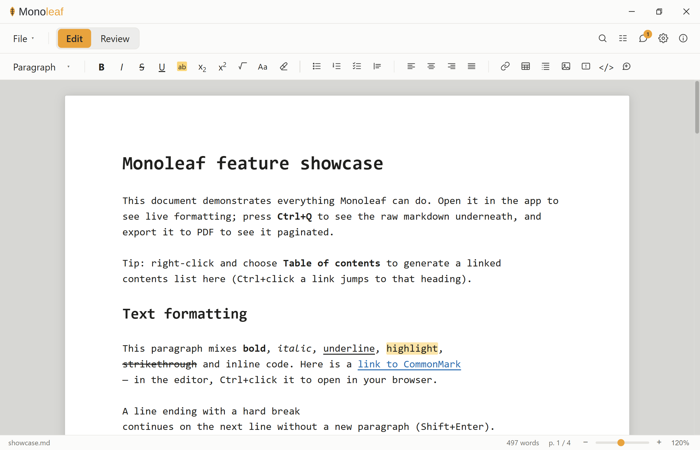

<div align="center">

<picture>
  <source media="(prefers-color-scheme: dark)" srcset="branding/monoleaf-wordmark-ondark.svg">
  
</picture>

**A portable, single-file WYSIWYG Markdown editor.**

One `.md` file is the whole document: no sidecars, no lock-in, no database.
What you write stays plain Markdown that any editor, GitHub, or an LLM can read.

[](https://github.com/vibingbiochemist/Monoleaf/releases)
[](LICENSE)
[](https://github.com/vibingbiochemist/Monoleaf/releases)
[](https://tauri.app)

[**monoleaf.org**](https://monoleaf.org) · [Download](https://github.com/vibingbiochemist/Monoleaf/releases) · [Report an issue](https://github.com/vibingbiochemist/Monoleaf/issues)

</div>

<p align="center">
  
</p>

---

## What is Monoleaf?

Monoleaf is a desktop Markdown editor that renders your document **as you type**
(headings, bold, tables, math, diagrams-as-text, callouts) while the underlying
file stays **pure Markdown**. There is no proprietary format and no companion
folder: the single `.md` you save *is* the document, byte for byte.

It is built for people who want the comfort of a word processor and the
longevity of plain text: scientists writing protocols and reports, engineers
writing docs, anyone who wants their work to still open cleanly in ten years.

## Why Monoleaf is different

- **The raw Markdown is the single source of truth.** The editor never keeps a
  hidden model; it edits the text directly. Toggle to the raw view any time
  (`Ctrl+Q`) and it's exactly what's on disk.
- **One file, and only that file.** Everything travels inside the `.md`: page
  setup, document properties, the table of contents, review comments, tracked
  changes. No `.meta`, no `assets/` folder. (The single exception is PDF/HTML
  *export*, which you ask for explicitly.)
- **Lossless, byte-for-byte round-trip.** Open a file and save it untouched and
  it is identical: line endings (CRLF/CR/LF), BOMs, missing trailing newlines
  and all. This is enforced by tests, not hoped for.
- **Graceful degradation everywhere else.** Constructs that other viewers don't
  understand (callouts, comments, page config) are written as ordinary
  blockquotes or HTML comments, so the file still reads perfectly on GitHub or
  in any plain editor.
- **Local and private.** No account, no cloud, no telemetry. Your files never
  leave your machine. Monoleaf can optionally check `github.com` for a new
  version at startup; it is off until you turn it on, and it sends nothing but
  the request itself.

## Features

**Writing**
- Silent WYSIWYG live preview: formatting renders in place, syntax markers stay
  hidden while you edit
- Bold, italic, strikethrough, inline code, underline, highlight, sub/superscript
- Headings, bullet/numbered/task lists, blockquotes, tables, horizontal rules
- **Change case** (UPPERCASE / lowercase / Title / Sentence) and **clear
  formatting**
- **Admonitions / callouts**: GitHub-style `> [!NOTE]`, `[!TIP]`, `[!WARNING]`, …
- **LaTeX math** (`$…$` / `$$…$$`), rendered live and in export
- **Fenced code** with syntax highlighting
- **Footnotes**, and an **outline sidebar** for navigation
- Paste from Word/Excel/web → clean Markdown (tables included)

**Document**
- **Table of contents** with in-app heading navigation
- **Document properties** (title / author / date / subject / keywords) stored
  in-file, as a hidden comment or YAML front matter
- **Page setup**: size, margins, font, header/footer with `{page}`/`{pages}`/
  `{title}`/`{author}`/`{date}`, stored in the file
- **Bundled document fonts** (Source Serif 4, Lora, Source Sans 3, Atkinson
  Hyperlegible Next, Lexend, plus IBM Plex Mono for code): chosen per document
  rather than drawn from your system, so the document renders and paginates
  identically on every machine
- **Find & replace**, live **word count**, and a real **page-accurate layout**
  view with zoom (buttons, slider, or `Ctrl`+scroll)

**Review**
- **Comments**: inline, threaded, resolvable; anchored in the text with no
  offsets or sidecar files
- **Tracked changes** (CriticMarkup): insertions/deletions/substitutions with
  accept/reject, fully git-diffable

**Export**
- **PDF** with true page geometry via CSS Paged Media (choose *Save as PDF* in
  the print dialog)
- **Self-contained HTML**: one portable file, styles inlined, chosen font
  embedded, no external resources, dark-mode aware

**Open & import**
- **Markdown** (`.md`, `.markdown`): File ▸ Open, byte-for-byte, nothing rewritten
- **PDF** (`.pdf`): File ▸ **Import from PDF…**, a separate command because a PDF
  is converted rather than opened. The result is a new unsaved document,
  named from the PDF's title metadata. Headings, paragraphs, lists and tables are
  recovered from the page's own geometry; the result is plain CommonMark + GFM
  with no properties block, tracked changes or comments, just like a new document.
  The PDF itself is only read; saving asks for a `.md` name. A PDF that Monoleaf
  exported re-imports with its structure intact.
  Best-effort by nature, with known limits: **tables** are rebuilt from their
  ruled borders, so a borderless, whitespace-aligned table arrives as text in
  reading order (no cell text is lost) and merged cells flatten; **multi-column**
  layouts are split on a gutter and can still interleave on complex pages;
  **scanned/image-only** PDFs are refused with an explanation, as there is no
  OCR; **bold-only headings** at body size read as paragraphs; **images are
  dropped**. Encrypted and damaged files fail with a clear message.

**Portability**
- **Strict / Enhanced** modes with opt-in flagging of anything beyond
  CommonMark + GFM, so you always know how portable your document is
- Light & dark themes; autosave with crash recovery; reopen-last-file
- **Remote images are not loaded unless you enable them** (Settings ▸ Load
  remote images). Opening a document otherwise fetches every image it
  references, which tells whoever wrote it when and from where you opened it.
  A blocked image shows as its alt text instead

## Download & install

Grab the latest release from the
[**Releases**](https://github.com/vibingbiochemist/Monoleaf/releases) page.

### Windows

Run the installer.

- Installs **per-user**, with **no administrator rights** required.
- If your machine lacks the Microsoft **WebView2** runtime, the installer
  fetches it automatically.

> **Note:** the installer is **not code-signed**, so Windows SmartScreen may warn
> about an "unknown publisher." Choose **More info → Run anyway**. Signing means
> paying a commercial certificate authority every year, which is hard to justify for
> a free tool with one maintainer, so it is **not planned** rather than pending. If
> you would rather not run an unsigned binary, build it yourself: see below.

### macOS

Open the `.dmg` and drag Monoleaf into Applications.

> **Note:** the `.dmg` is **unsigned and unnotarized** — there is no Apple
> Developer account, and none is planned; the yearly cost is hard to justify
> for a free tool with one maintainer. Gatekeeper will refuse to open the app
> on a plain double-click ("Monoleaf is damaged and can't be opened," or
> similar). **Right-click (or Control-click) the app and choose Open**, then
> confirm **Open** again in the dialog that follows — this only needs doing
> once. If you would rather not run an unsigned binary, build it yourself: see
> below.

### Linux

Download the `.AppImage`, make it executable, and run it:

```bash
chmod +x Monoleaf_*.AppImage
./Monoleaf_*.AppImage
```

> **Note:** the Linux build is **community-tested, best-effort** — it isn't
> exercised as broadly as Windows, so please
> [file an issue](https://github.com/vibingbiochemist/Monoleaf/issues) if you
> hit a problem with it. Unlike Windows, there is no OS-level signing prompt to
> click through: AppImage runs directly, with no publisher warning.

## Build from source

Requires **Node + npm** and a **Rust toolchain** (MSVC on Windows).

```bash
npm install
npm run tauri dev      # run the app in development
npm run tauri build    # build the installer → src-tauri/target/release/bundle/
```

### Platform support

**Windows, macOS and Linux are all distributed; Windows is the most
thoroughly tested of the three.** Where each platform stands:

- **Windows**: primary target, most exercised.
- **macOS**: shipped as an unsigned, unnotarized `.dmg` — see the note in the
  download section above for the Gatekeeper workaround. Community-tested
  rather than exercised as broadly as Windows.
- **Linux**: shipped as an AppImage, but community-tested rather than
  exercised as broadly as Windows — see the note in the download section
  above.
- Everything the editor does is portable in principle. Native spell-checking is
  the one Windows-specific feature, and it is compiled out elsewhere rather than
  breaking the build.

If you hit anything on macOS or Linux, reports are welcome — that is the
fastest route to making both as thoroughly exercised as Windows.

## Keyboard shortcuts

| Action | Shortcut |
| --- | --- |
| Bold / Italic / Strikethrough | `Ctrl+B` / `Ctrl+I` / `Ctrl+Shift+X` |
| Inline code / Underline / Highlight | `` Ctrl+` `` / `Ctrl+U` / `Ctrl+Alt+H` |
| Subscript / Superscript | `Ctrl+=` / `Ctrl+Shift+=` |
| Heading 1-6 / paragraph | `Ctrl+Shift+1`…`6` / `Ctrl+Shift+0` |
| Align left / center / right / justify | `Ctrl+L` / `Ctrl+E` / `Ctrl+R` / `Ctrl+J` |
| Link / equation / comment | `Ctrl+K` / `Ctrl+M` / `Ctrl+Shift+M` |
| Page break | `Ctrl+Enter` |
| Toggle live / raw view | `Ctrl+Q` |
| Find & replace | `Ctrl+F` |
| Zoom | `Ctrl`+scroll, or the status-bar controls |

## Development

Everything a change has to pass:

```bash
npx tsc --noEmit                                   # type-check
npm run lint                                       # ESLint
npm run format:check                               # Prettier
npm test                                           # frontend tests (Vitest)
cargo fmt --manifest-path src-tauri/Cargo.toml -- --check
cargo clippy --manifest-path src-tauri/Cargo.toml --all-targets -- -D warnings
cargo test --manifest-path src-tauri/Cargo.toml    # Rust unit + integration
```

The round-trip tests assert the hard guarantee: a file loaded and saved with no
edits serializes **byte-for-byte identically**. The load/save logic under test
(`src/document.ts`) is the same code the app runs.

### End-to-end tests

`npm run test:e2e` launches the built application and checks it from outside:
that it starts and runs its own frontend, that a file given on the command line
opens, and that a second launch gets its own window. Run `npm run tauri build`
first, since it deliberately tests that binary: the bugs it exists to catch
(a frontend that was never embedded, a window that opens blank) only appear in a
release build.

**It is Windows-only today, and skips cleanly elsewhere**: `npm run test:e2e`
exits 0 on macOS and Linux with the reason stated, rather than failing on
something you cannot fix. The obstacle is the signal it asserts on: it reads
window titles, and there is no portable way to do that. Wayland deliberately
forbids a client from inspecting other clients' windows, and macOS gates it
behind an Accessibility permission that CI cannot grant.

Making it portable means changing *what* is observed rather than porting *how*:
having the app report its own readiness through a file, which works identically
everywhere and needs no window tooling. That is planned, not done.

Key modules: `src/document.ts` (round-trip load/serialize), `src/livepreview.ts`
(live-preview decorations), `src/commands.ts` (formatting commands),
`src/export.ts` (PDF/HTML rendering), `src/comments.ts` + `src/critic.ts`
(review), `src-tauri/src/lib.rs` (byte-exact file I/O).

## Changelog

Notable changes are recorded in [CHANGELOG.md](CHANGELOG.md).

## Contributing

Contributions are welcome. Please read [CONTRIBUTING.md](CONTRIBUTING.md) for the
workflow and coding conventions, and note the project's
[Code of Conduct](CODE_OF_CONDUCT.md). To report a security issue, see
[SECURITY.md](SECURITY.md).

## License

Monoleaf is released under the [MIT License](LICENSE).

Third-party dependencies and their licenses are listed in
[THIRD_PARTY_LICENSES.md](THIRD_PARTY_LICENSES.md) (also viewable in-app via the
**ⓘ** button), and generated with `npm run licenses`.

## Acknowledgements

Built with [Tauri](https://tauri.app), [CodeMirror 6](https://codemirror.net),
[markdown-it](https://github.com/markdown-it/markdown-it),
[Paged.js](https://pagedjs.org), [KaTeX](https://katex.org), and
[highlight.js](https://highlightjs.org).
